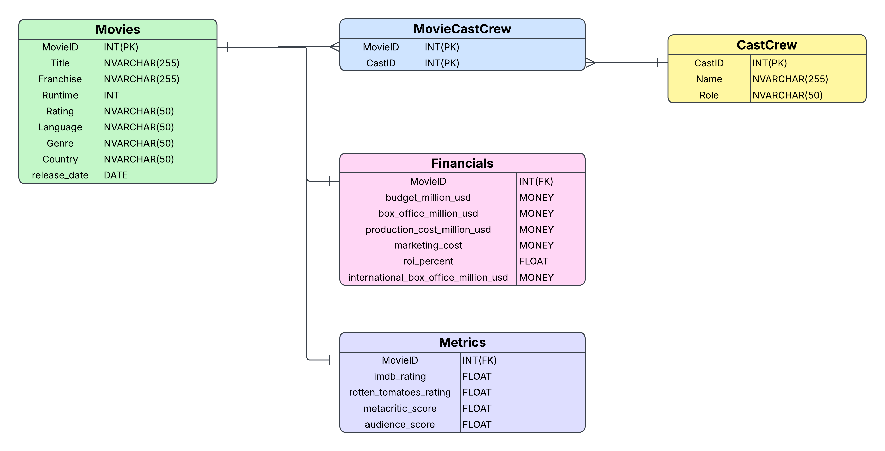

# Disney Movies Database

This project contains a relational database design and SQL script for a Disney movie dataset inspired by the Kaggle dataset: [The Disney Movies Dataset](https://www.kaggle.com/datasets/crystalbaby/the-disney-movies-dataset).

The database is structured to store movie metadata, financial performance, audience/critic ratings, and the relationship between movies and people involved in them.

## Overview

The dataset is modeled as a normalized relational schema with these core entities:

- Movies
- People
- MoviePeople
- Financials
- Metrics

The goal is to make the data easier to query for analysis such as:

- movie catalog exploration
- franchise trends and title patterns
- runtime, genre, language, and rating analysis
- financial benchmarking across films
- cast/crew association queries
- critic vs audience score comparisons

## Entity Relationship Diagram

## Schema Summary

### 1. Movies
Stores the core movie metadata.

| Column | Type | Description |
| --- | --- | --- |
| MovieID | INT (PK) | Unique movie identifier |
| Title | NVARCHAR(255) | Movie title |
| Franchise | NVARCHAR(255) | Franchise or series name |
| Runtime | INT | Runtime in minutes |
| Rating | NVARCHAR(50) | MPAA-style or descriptive rating |
| Language | NVARCHAR(50) | Original/primary language |
| Genre | NVARCHAR(50) | Movie genre |
| Country | NVARCHAR(50) | Production country |
| Release_Date | DATE | Release date |

### 2. People
Stores people associated with a movie, such as actors, directors, or crew members.

| Column | Type | Description |
| --- | --- | --- |
| PeopleID | INT (PK) | Unique person identifier |
| Name | NVARCHAR(255) | Person name |
| Role | NVARCHAR(50) | Role such as actor, director, or crew |

### 3. MoviePeople
Bridge table linking movies to people.

| Column | Type | Description |
| --- | --- | --- |
| MovieID | INT (FK) | Foreign key to Movies |
| PeopleID | INT (FK) | Foreign key to People |

This table supports a many-to-many relationship where one movie can have many people and one person can be associated with many movies.

### 4. Financials
Stores financial performance data associated with each movie.

| Column | Type | Description |
| --- | --- | --- |
| MovieID | INT (PK, UNIQUE) | Linked movie |
| budget_million_usd | MONEY | Budget in millions USD |
| box_office_million_usd | MONEY | Box office revenue in millions USD |
| production_cost_million_usd | MONEY | Production cost in millions USD |
| marketing_cost | MONEY | Marketing spend |
| roi_percent | FLOAT | Return on investment percentage |
| international_box_office_million_usd | MONEY | International box office revenue |

### 5. Metrics
Stores audience and critical performance indicators.

| Column | Type | Description |
| --- | --- | --- |
| MovieID | INT (PK, UNIQUE) | Linked movie |
| imdb_rating | FLOAT | IMDb rating |
| rotten_tomatoes_rating | FLOAT | Rotten Tomatoes score |
| metacritic_score | FLOAT | Metacritic rating |
| audience_score | FLOAT | Audience score |

## Relationships

The core relationship model is:

- Movies has a one-to-one relationship with Financials
- Movies has a one-to-one relationship with Metrics
- Movies has a many-to-many relationship with People through MoviePeople

## Project Files

- SQL Script: contains the full CREATE TABLE statements and sample insert data for the Disney movie database
- erd.png: visual representation of the ERD
- README.md: project documentation

## How to Use

1. Open the SQL script in SQL Server Management Studio or Azure Data Studio.
2. Run the CREATE TABLE statements first.
3. Load the sample data inserts if provided in the script.
4. Query the database using the defined relationships.

## Notes

This dataset is designed for database modeling and analytical exploration rather than production-grade source-of-truth data. It is useful for learning SQL, relational modeling, and reporting workflows.

## Source

- Kaggle: [The Disney Movies Dataset](https://www.kaggle.com/datasets/crystalbaby/the-disney-movies-dataset)
- Dataset author: crystalbaby

